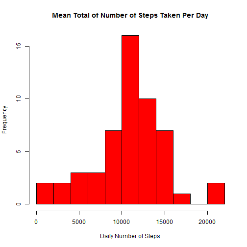
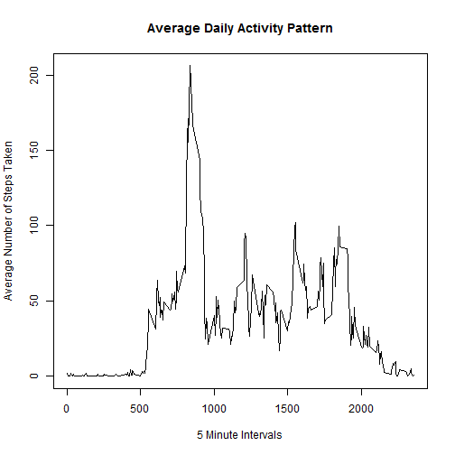
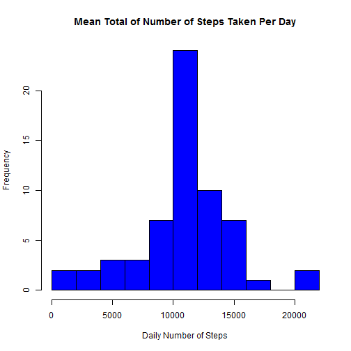
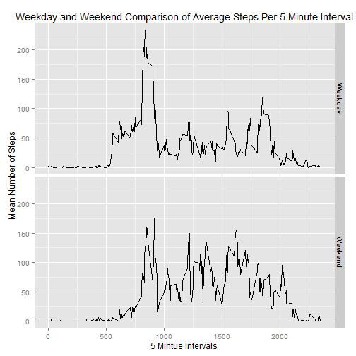

### Loading and preprocessing the data


```r
activity_data = read.csv("activity.csv",stringsAsFactors = FALSE)
```

### What is the mean total number of steps taken per day?


```r
data_aggregate<-aggregate(steps ~ date, activity_data, sum)
hist(data_aggregate$steps, col = "Red", border = "Black", main = "Mean Total of Number of Steps Taken Per Day", xlab = "Daily Number of Steps", ylab = "Frequency", breaks = 10)
```

 

```r
mean(data_aggregate$steps)
```

```
## [1] 10766.19
```

```r
median(data_aggregate$steps)
```

```
## [1] 10765
```

### What is the average daily activity pattern?


```r
mean_interval <- aggregate(steps ~ interval, activity_data, mean)
plot(mean_interval$interval, mean_interval$steps, type = "l", main = "Average Daily Activity Pattern", xlab = "5 Minute Intervals", ylab = "Average Number of Steps Taken")
```

 

### Which 5-minute interval, on average across all the days in the dataset, contains the maximum number of steps?


```r
mean_interval[which.max(mean_interval$steps),]
```

```
##     interval    steps
## 104      835 206.1698
```

### Imputing missing values

Calculate and report the total number of missing values in the dataset (i.e. the total number of rows with NAs)


```r
sum(is.na(activity_data$steps))
```

```
## [1] 2304
```

Impute values by merging the aggregated data with the raw data by the interval.  After merging the data, replace the NA values from the steps column with the newly created column indicating mean steps for a particular interval.


```r
new_activity_data <- merge(activity_data, mean_interval , by = "interval")
is_na <- is.na(new_activity_data$steps.x)
new_activity_data$steps.x[is_na] <- new_activity_data$steps.y[is_na]
```

Make a histogram of the total number of steps taken each day and Calculate and report the mean and median total number of steps taken per day.


```r
aggregated_new<-aggregate(steps.x~date, new_activity_data, sum)
hist(aggregated_new$steps.x, col = "Blue", border = "Black", main = "Mean Total of Number of Steps Taken Per Day", xlab = "Daily Number of Steps", ylab = "Frequency", breaks = 10)
```

 

### Are there differences in activity patterns between weekdays and weekends?


```r
library(ggplot2)
activity_data$date<-as.Date(activity_data$date)
activity_data$weekday<-weekdays(activity_data$date)
activity_data$day<- ifelse(activity_data$weekday %in% c("Saturday","Sunday"),"Weekend","Weekday")
mean_day_interval <- aggregate(steps ~ interval + day, activity_data, mean)
ggplot(mean_day_interval, aes(x = interval, y = steps))+ geom_line(colour = "black", size = .3)+ facet_grid(day~.)+ xlab("5 Mintue Intervals")+ ylab("Mean Number of Steps")+ggtitle("Weekday and Weekend Comparison of Average Steps Per 5 Minute Interval")
```

 
